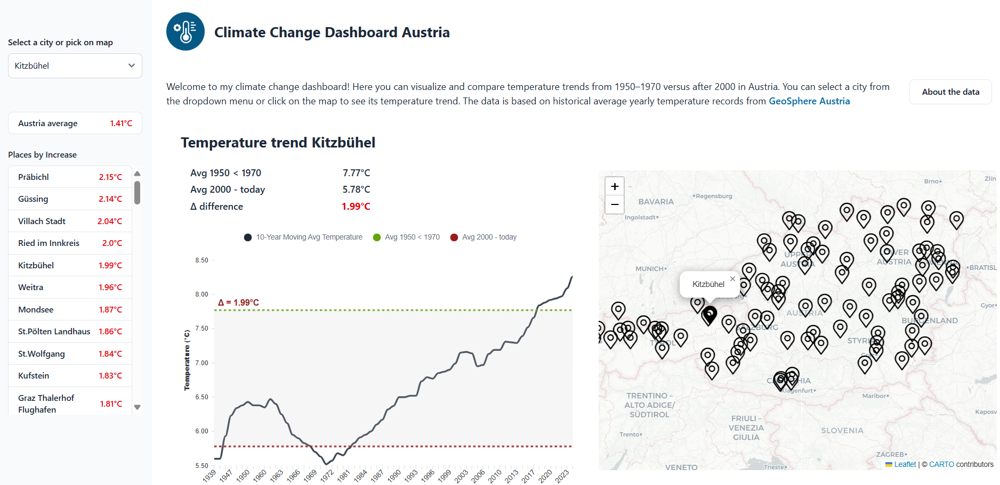

# 🌍 Climate Change in Austria

A FastAPI-powered web application that visualizes the effects of climate change across Austrian towns using historical temperature data from a DuckDB database.

## Features

- 🌡️ Interactive display of climate data for Austrian towns
- 📊 Visualization of temperature deltas and 10-year rolling averages
- 🔍 Selectable town-specific statistics with comparison to the national average
- ⚡ Fast API and DuckDB powered backend

## Live Demo

👉 **View the live dashboard here** [climateaustria.vinzenzhalhammer.com](https://climateaustria.vinzenzhalhammer.com)



## Installation

1. **Clone the repository**

```bash
git clone https://github.com/vinzenzhalhammer/climate_change_austria.git
cd climate_change_austria
```

2. **Install dependencies with [uv](https://github.com/astral-sh/uv)**

Make sure you have Python 3.12+ and `uv` installed. Alternatively, you can use `pip`, `poetry`, ... or what you prefer, the dependencies are defined in `pyproject.toml`:

```bash
uv sync
```

3. **Run the app**

```bash
uv run uvicorn main:app --reload
```

Visit [http://localhost:8000](http://localhost:8000) to view the application.

## Docker

To build and run the app in Docker:

```bash
docker-compose up --build
```
Visit [http://localhost:8080](http://localhost:8080) to view the application.

## Data Source
The application uses historical temperature data from the [Geosphere Austria](https://www.geosphere.at/en) and stores it in a DuckDB database. The data is processed to calculate temperature deltas and rolling averages.

